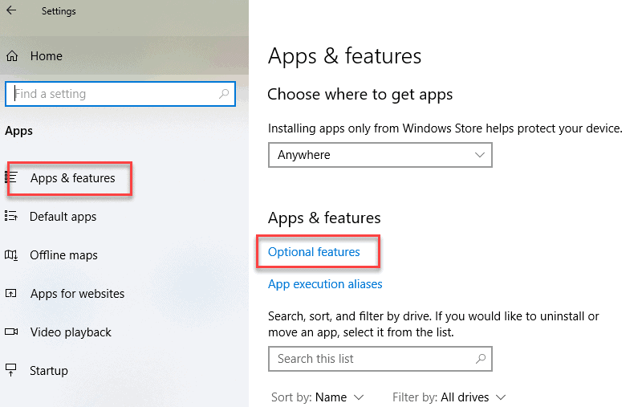

# SSH kulcs beállítása

0. Windows esetén:



1. Kulcs generálása:
```powershell
ssh-keygen -t ed25519 -C "your_email@example.com"
```

2. Kulcs hozzáadása Github-hoz
3. Repó letöltése SSH-val


# GPG aláírás

1. GPG letöltése: https://www.gpg4win.org/
2. Telepítés után gpg kulcs generálása
```powershell
gpg --full-generate-key
```
3. Kulcs exportálása
```powershell
gpg --list-secret-keys --keyid-format=long
gpg --armor --export <ID>
```
4. Kulcs hozzáadása Github-hoz
5. Git beállítása, hogy a kulcsot használja
```powershell
git config --global user.signingkey <KULCS>
git config --global commit.gpgsign true
git config --global gpg.program "C:\Program Files (x86)\GnuPG\bin\gpg.exe"
```